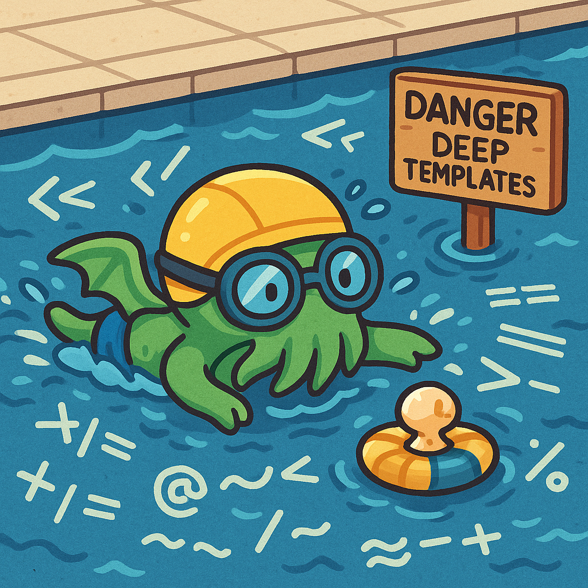
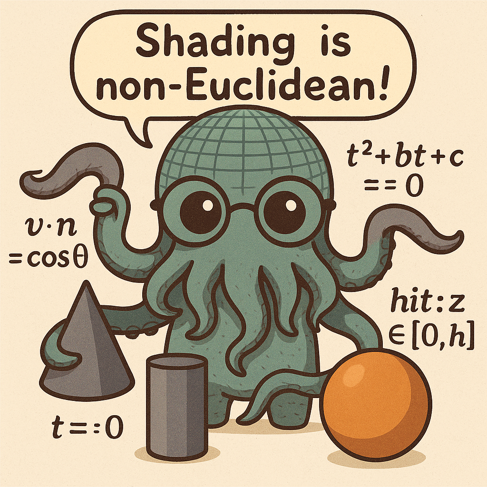
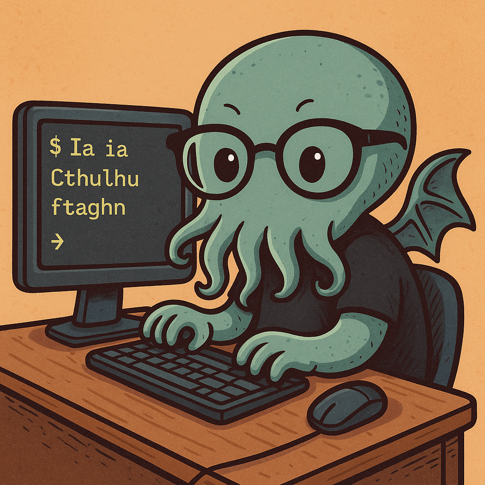
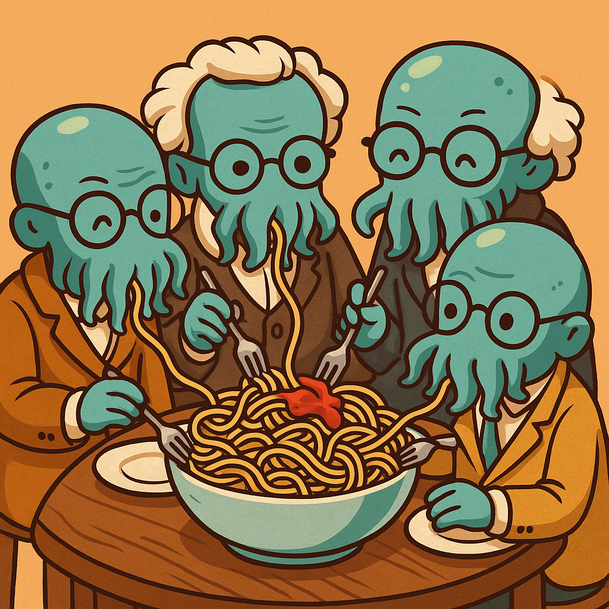
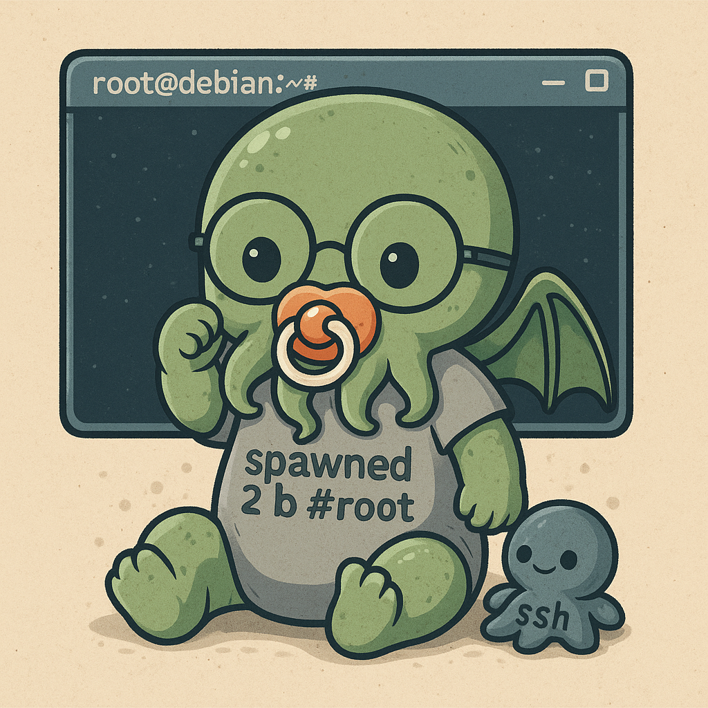
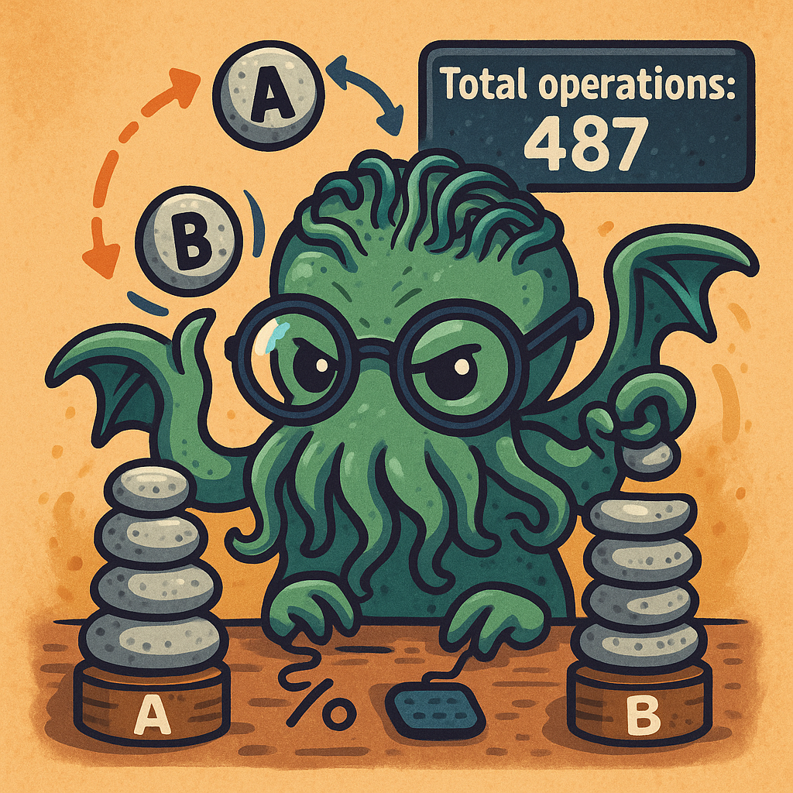
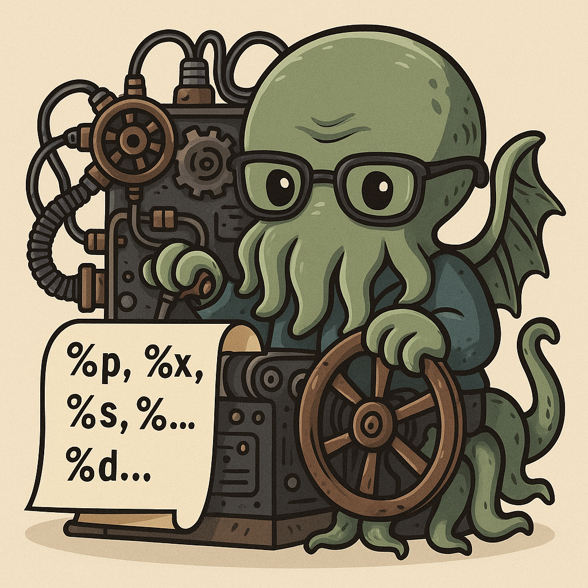
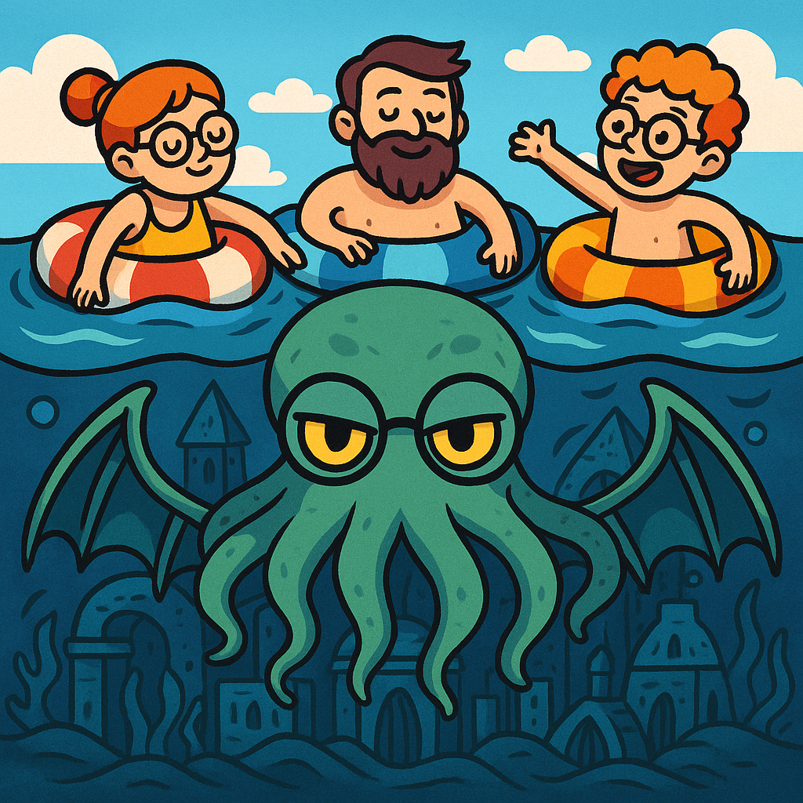

###### [🇫🇷 Version française](README.fr.md) / [🇬🇧 English version](README.md)

Voici la traduction en français avec mise en forme Markdown conservée :

### Bonjour et bienvenue !

Je m'appelle Christophe Donnat, actuellement étudiant développeur junior à 42 Perpignan (France).  
Après une longue carrière dans des postes à responsabilité dans le secteur commercial, j’ai décidé de plonger dans le monde du code.

Pourquoi ? Parce que j’aime la technologie. Je crois en la structure, en la logique, et en les algorithmes.  
J’avais un fort désir de réapprendre, de challenger et stimuler mes capacités cognitives, tout en acquérant un métier créatif où l’on construit réellement quelque chose.  
De ma carrière précédente, je garde un grand sens de la discipline, de la responsabilité et de l’optimisation — des qualités que j’applique désormais au quotidien dans le domaine de la tech.

### Qu’est-ce que je fais ici ?  
Ce dépôt GitHub regroupe les projets que j’ai réalisés à 42, souvent accompagnés de documentations techniques approfondies ou de tutoriels complets.  
Vous pouvez y découvrir les compétences que j’ai développées tout au long de mon parcours.

### Cursus principal de 42

| [Transcendance]() | [Inception](https://github.com/donnatchris/inception-42) | [Webserv](https://github.com/donnatchris/webserv-42) | [Piscine C++](https://github.com/donnatchris/piscine-cpp-42) | [Mini RT](https://github.com/donnatchris/minirt-42) |
| --- | --- | --- | --- | --- |
|  |  |  |  |  |

| [FilDeFer](https://github.com/donnatchris/fdf-42) | [Minishell](https://github.com/donnatchris/minishell-42) | [Philosopher](https://github.com/donnatchris/philosophers-42) | [Minitalk](https://github.com/donnatchris/minitalk-42) | [Born2BeRoot](https://github.com/donnatchris/born2beroot-42) |
| --- | --- | --- | --- | --- |
|  |  |  |  |  |

| [Push Swap](https://github.com/donnatchris/push_swap-42) | [GetNextLine](https://github.com/donnatchris/get_next_line-42) | [FtPrintf](https://github.com/donnatchris/ft_printf-42) | [Libft](https://github.com/donnatchris/libft-42) | [Piscine C](https://github.com/donnatchris/piscine-42) |
| --- | --- | --- | --- | --- |
|  |  |  |  |  |

