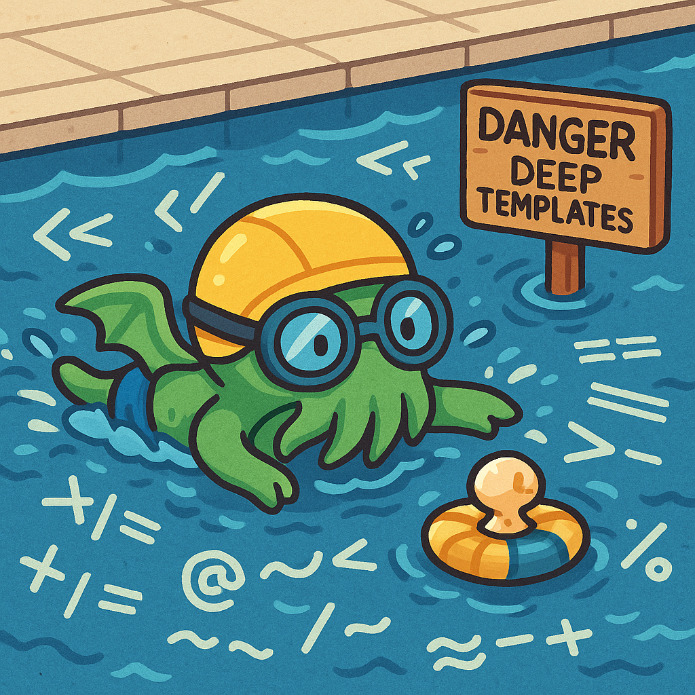
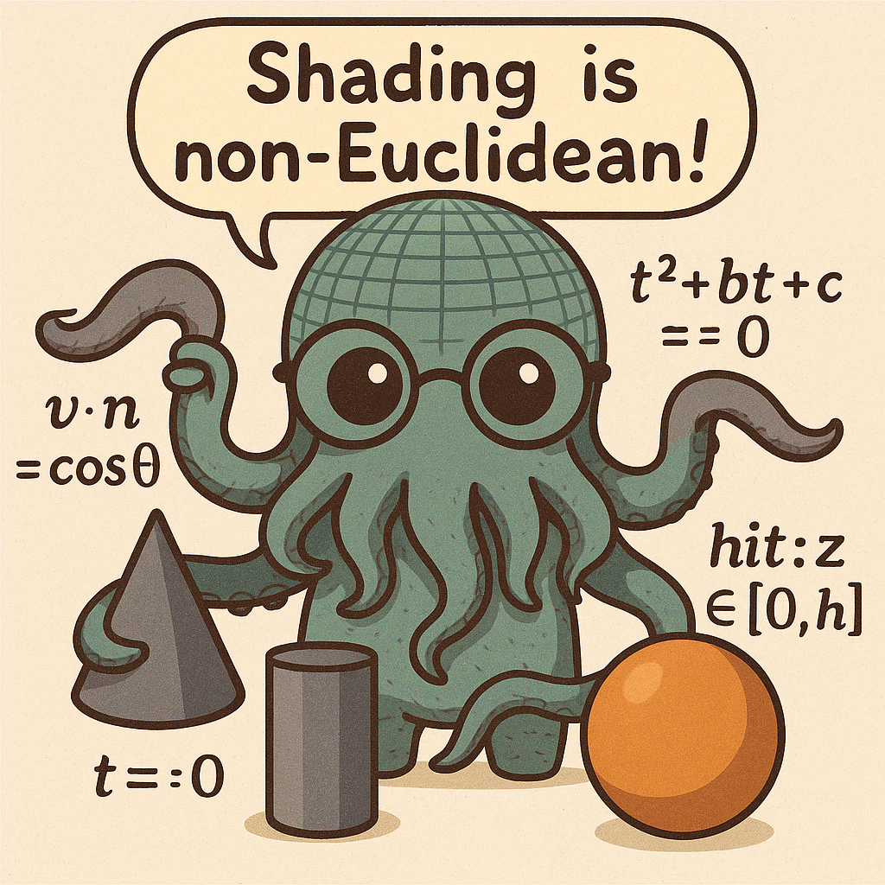
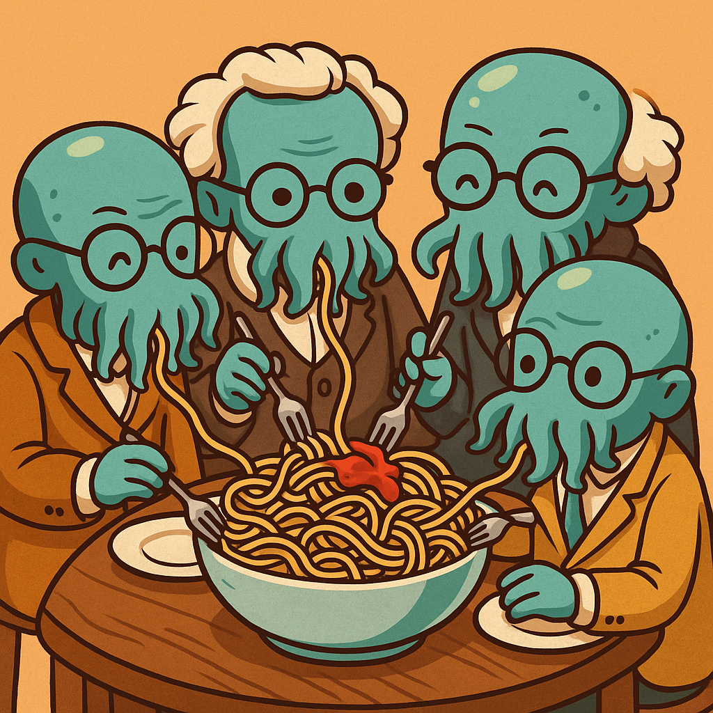
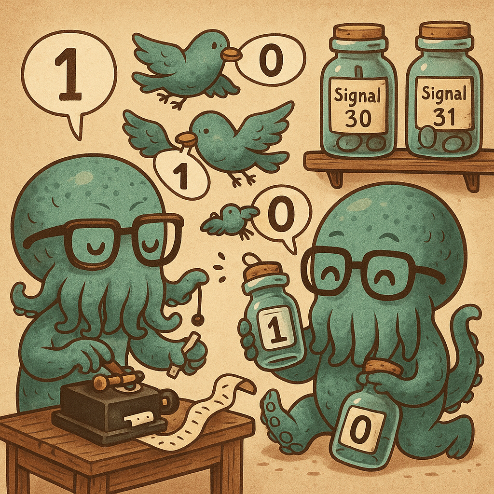
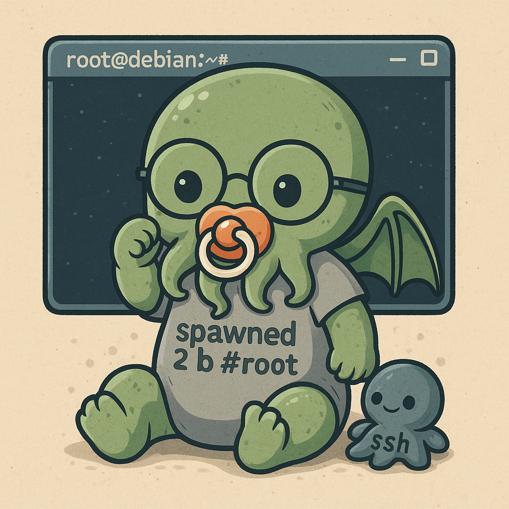
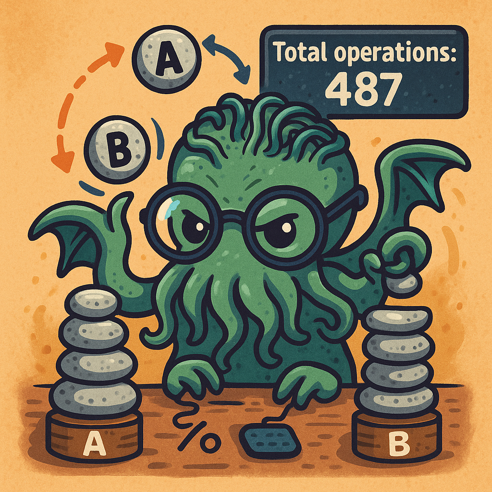
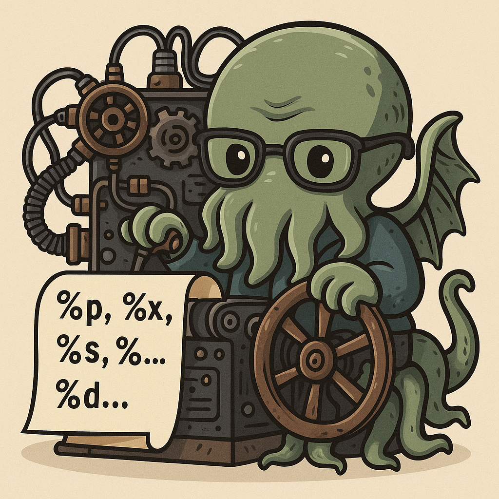

###### [🇫🇷 Version française](README.fr.md) / [🇬🇧 English version](README.md)

### Bonjour et bienvenue !

Je m'appelle Christophe Donnat, actuellement étudiant développeur à 42 Perpignan (France) en stage professionnel pour les musées d'Occitanie.
Après une longue carrière à des postes à responsabilité dans le secteur commercial, j’ai décidé de plonger dans le monde du code.

Pourquoi ? Parce que j’aime la technologie. Je crois en la structure, la logique, et l'algorithmie.
J’avais un fort désir d'apprendre à nouveau, de challenger et stimuler mes capacités cognitives, tout en acquérant un métier créatif où l’on construit réellement quelque chose.
De ma carrière précédente, je garde un grand sens de la discipline, de la responsabilité et de l’optimisation — des qualités que j’applique désormais au quotidien dans le domaine de la tech.

### Qu’est-ce que je fais ici ?  
Ce dépôt GitHub regroupe les projets que j’ai réalisés à 42, généralement accompagnés de documentations techniques approfondies ou de tutoriels complets.
Vous pouvez y découvrir les compétences que j’ai développées tout au long de mon parcours.

### Actualité récente

Depuis décembre 2025, je développe **La Ressourcerie**, une plateforme web dédiée aux musées d’Occitanie.

🎯 **Problème**  
Des réserves saturées, des budgets en baisse, et en parallèle des besoins ponctuels non couverts.

💡 **Solution**  
Une plateforme de mutualisation permettant aux musées de **prêter, réserver et partager du matériel muséographique** simplement, entre professionnels.

**Ce que j’ai construit**  
- Catalogue structuré avec taxonomie avancée  
- Recherche multi-critères (type, caractéristiques, rayon géographique…)  
- Gestion fine des rôles, droits et organisations  
- Système complet de réservation et de disponibilités  
- Workflow de transactions (demande, validation, prêt, retour…)  
- Génération automatique de conventions de prêt  
- Notifications temps réel (in-app + e-mail)  
- Dashboard de suivi

**Ce qui arrive**  
- Panier pour préparer une exposition  
- Wishlist (expression de besoins)  
- Matching intelligent entre offre et demande  

**Approche**  
Produit conçu **avec et pour les musées**, en développement agile: collaboration directe avec les équipes terrain (rencontres pour recueillir leurs besoins et leurs attentes, tests, retours quotidiens, itérations rapides).

**Accès**  
Projet privé (repository non public).  
Plateforme accessible uniquement sur invitation.

👉 https://ressourcerie.musees-occitanie.fr/

### Cursus principal de 42

| [Transcendance](https://github.com/donnatchris/ft_transcendance/blob/main/README.md) | [Inception](https://github.com/donnatchris/inception-42/blob/main/README.md) | [Webserv](https://github.com/donnatchris/webserv-42/blob/main/README.md) | [Piscine C++](https://github.com/donnatchris/piscine-cpp-42/blob/main/README.md) | [Mini RT](https://github.com/donnatchris/minirt-42/blob/main/README.md) |
| --- | --- | --- | --- | --- |
|  |  |  |  |  |

| [FilDeFer](https://github.com/donnatchris/fdf-42/blob/main/README.md) | [Minishell](https://github.com/donnatchris/minishell-42/blob/main/README.md) | [Philosopher](https://github.com/donnatchris/philosophers-42/blob/main/README.md) | [Minitalk](https://github.com/donnatchris/minitalk-42/blob/main/README.md) | [Born2BeRoot](https://github.com/donnatchris/born2beroot-42/blob/main/README.md) |
| --- | --- | --- | --- | --- |
|  |  |  |  |  |

| [Push Swap](https://github.com/donnatchris/push_swap-42/blob/main/README.md) | [GetNextLine](https://github.com/donnatchris/get_next_line-42/blob/main/README.md) | [FtPrintf](https://github.com/donnatchris/ft_printf-42/blob/main/README.md) | [Libft](https://github.com/donnatchris/libft-42/blob/main/README.md) | [Piscine C](https://github.com/donnatchris/piscine-42/blob/main/README.md) |
| --- | --- | --- | --- | --- |
|  |  |  |  |  |

