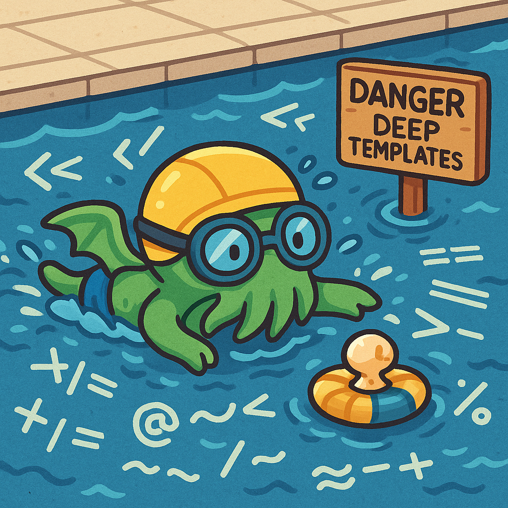
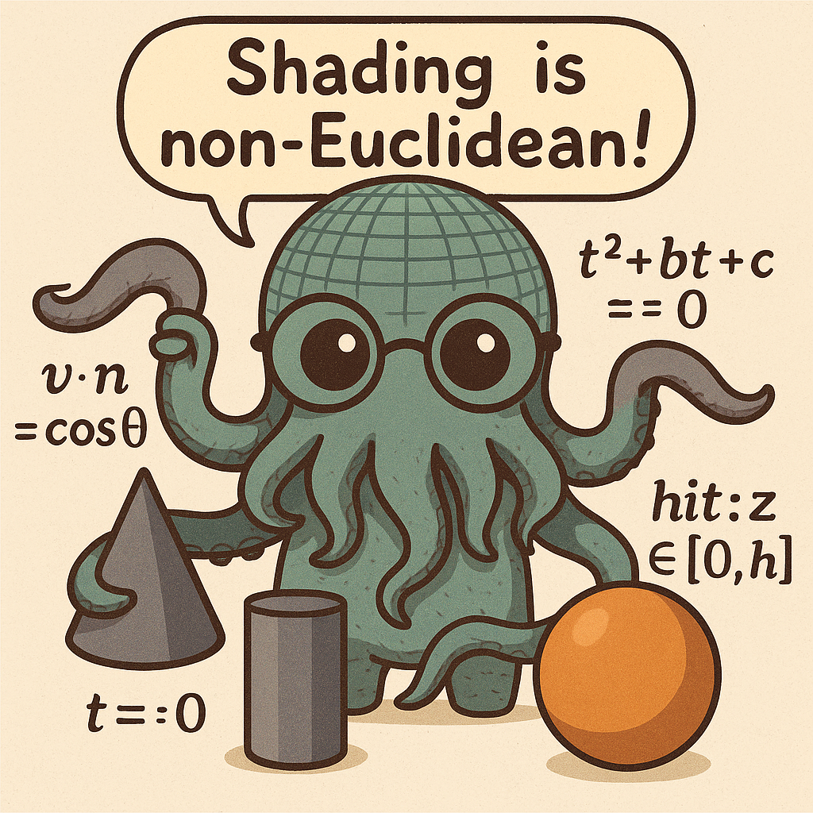
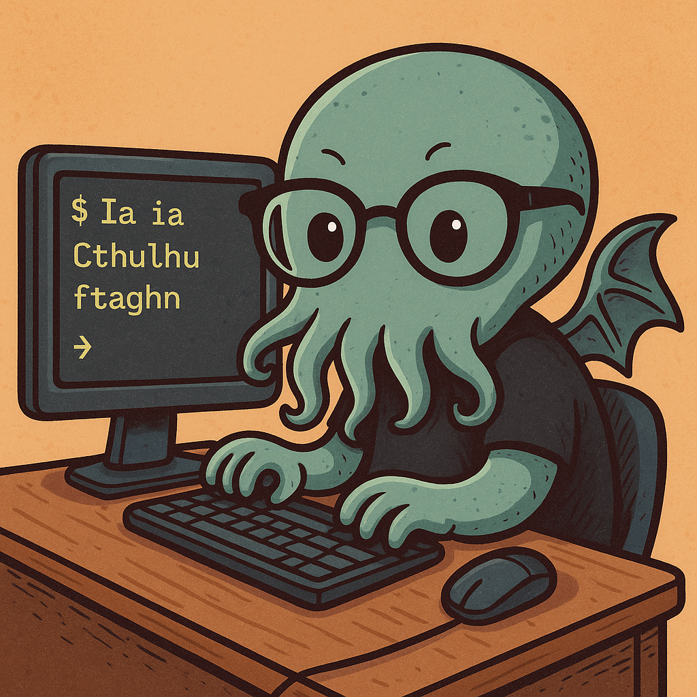
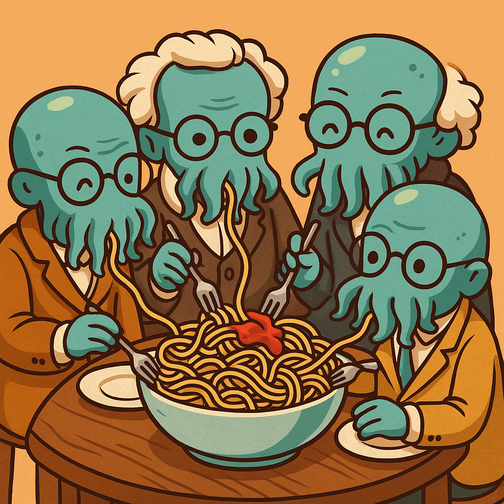

# Hello and welcome! 👋  

I'm **Christophe Donnat**, currently a student at *42 Perpignan*, France  
(*note: just "42", not "École 42"—they're serious about this* 😅).  

## What do I love most? 💡  
The thrill of solving:  
- 🔗 **Complex problems**  
- 🎲 **Unique challenges**  
- 🤯 **Occasionally mind-bending puzzles**  

There's nothing quite like untangling a twisted knot of logic and shouting, "It works!" 🙌  

## What am I doing here? 🧑‍💻  
This GitHub is where I share my coding adventures:  
- 🌱 Projects from my journey at **42**  
- 🧩 Algorithmic challenges, system programming, and more  
- 🚀 A growing portfolio as I explore the world of development  

Stay tuned—there’s more to come! 😉  

## A bit about me 🎮📚🎶  
When I’m not coding, I’m:  
- 📖 Geeking out over **sci-fi and fantasy literature** (ask me for recommendations!)  
- 🎮 Playing **video games** or **board games**  
- 🎸 Torturing a guitar (with mixed results)  
- 🎹 Failing spectacularly at piano  
- ✍️ Occasionally writing  
- 🚴‍♂️ Riding my bike (to feel virtuous, mostly)
- ✈️ Traveling across **Europe**, soaking up history, culture, and lots of great food 🍝 
- 👶 And in the little free time left, I’m a child wrangler and snack provider 🍪

## 42 Portfolio – Christophe Donnat

Welcome to my main GitHub repository!  
This is a visual summary of the projects I completed at 42 (Perpignan campus), featuring a cosmic Cthulhu twist.  
Each thumbnail links directly to the corresponding GitHub repository.

---

## 🚀 Custom Project Grid

| [Transcendance](https://github.com/chdonnat/transcendance-42) | [Inception](https://github.com/chdonnat/inception-42) | [Webserv](https://github.com/chdonnat/webserv-42) | [Piscine C++](https://github.com/chdonnat/piscine-cpp-42) | [MiniRT](https://github.com/chdonnat/minirt-42) |
| --- | --- | --- | --- | --- |
|  |  |  |  |  |

| [Minishell](https://github.com/chdonnat/minishell-42) | [Philosopher](https://github.com/chdonnat/philosopher-42) | [FDF](https://github.com/chdonnat/fdf-42) | [Get Next Line](https://github.com/chdonnat/get_next_line-42) | [ft_printf](https://github.com/chdonnat/ft_printf-42) |
| --- | --- | --- | --- | --- |
|  |  |  |  |   |

[Libft](https://github.com/chdonnat/libft-42) |
| --- | --- | --- | --- |
|  |

| [Piscine Reloaded](https://github.com/chdonnat/piscine-reloaded-42) | [Piscine C](https://github.com/chdonnat/piscine-c-42) |  |  |
| --- | --- | --- | --- |
|  |  |  |  |

---

> 🖼️ All thumbnails are original illustrations made for each project.  
> Some are cute. Some are cursed. All are tentacular.

