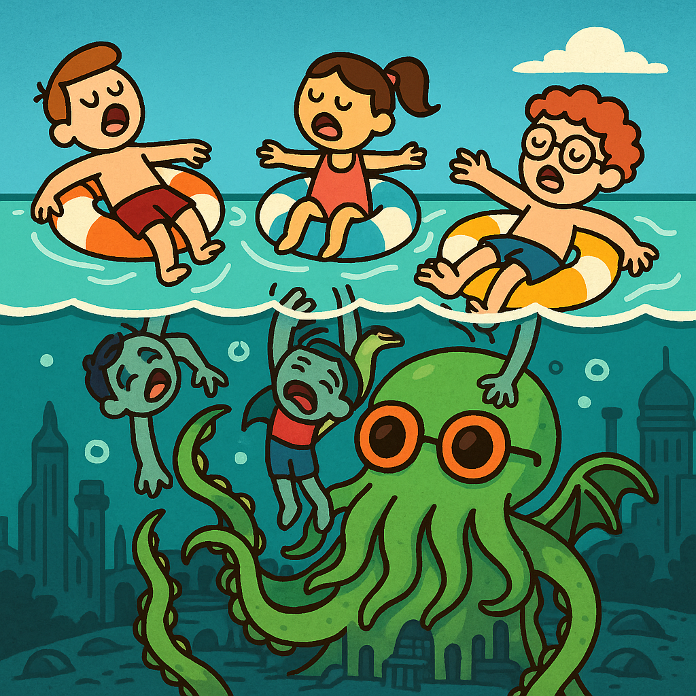

Hello and welcome!

I'm Christophe Donnat, currently a junior developer student at 42 Perpignan (France).  
After a long career holding management positions in the commercial sector, I decided to dive into the world of code.

**Why?** Because I love technology. I believe in structure, logic, and algorithms. I had a strong desire to learn again, to challenge and stimulate my cognitive abilities, while acquiring a creative profession where you actually build something.  
From my previous career, I bring a strong sense of discipline, responsibility, and optimization — qualities that I now apply daily in the world of tech.

**What am I doing here?**  
This GitHub repository is where I store the projects I've completed at 42, usually accompanied by in-depth technical documentation or full tutorials.  
This is where you can explore the skills I’ve developed along the way.

**A bit about me:**  
When I’m not coding, I enjoy playing and composing music, reading (sci-fi, fantasy, and popular science), practicing a bit of sport (cycling, paddle boarding), traveling across Europe, and feeding my two children — both their bellies and their minds.

---

## 42 Core curriculum

| [Transcendance]() | [Inception]() | [Webserv]() | [Piscine C++]() | [MiniRT]() |
| --- | --- | --- | --- | --- |
|  |  |  |  |  |

| [FDF]() | [Minishell]() | [Philosopher]() | [Minitalk]() | [Born2BeRoot]() |
| --- | --- | --- | --- | --- |
|  |  |  |  |  |

| [GetNextLine]() | [FtPrintf]() | [Libft]() | [Piscine Reloaded]() | [Piscine C]() |
| --- | --- | --- | --- | --- |
|  |  |  |  |  |

